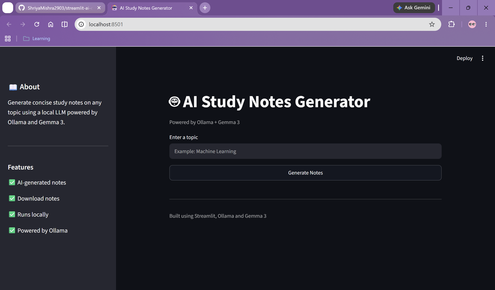
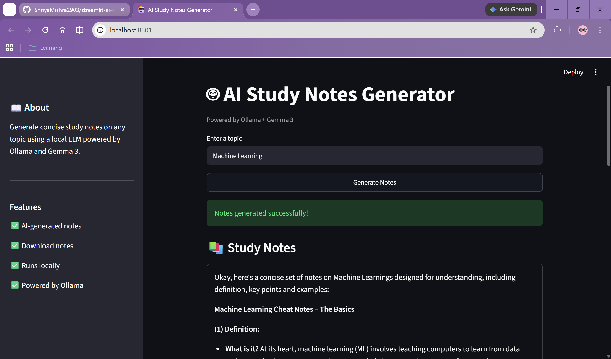
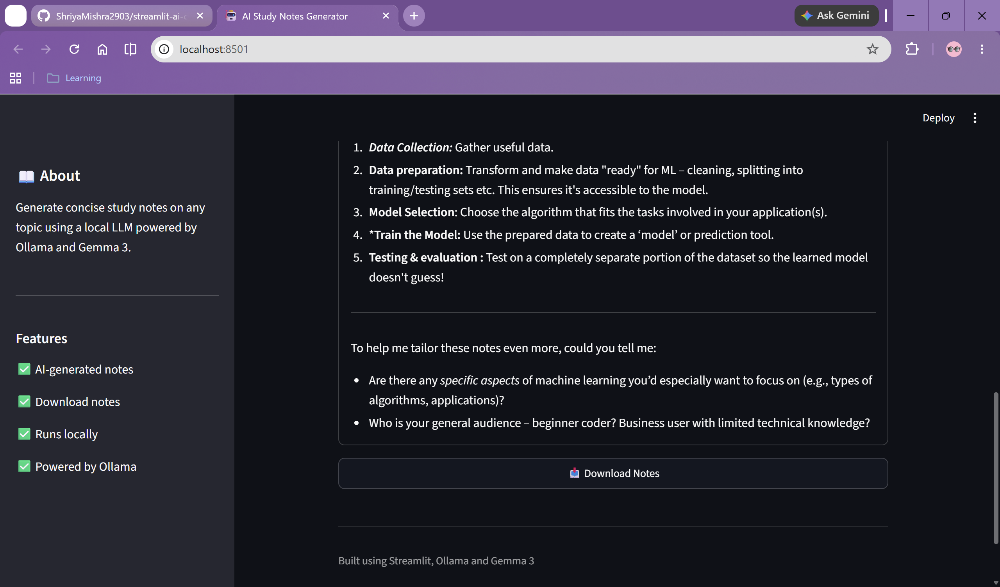

# AI Study Notes Generator

##  Overview

AI Study Notes Generator is a Streamlit application that uses a local Large Language Model (LLM) through Ollama and Gemma 3 to generate concise study notes on any topic.

Users can enter a topic, generate AI-powered notes, and download the generated content for later use.

---

##  Features

* AI-generated study notes
* Simple and clean Streamlit interface
* Powered by Ollama and Gemma 3
* Download generated notes as a text file
* Runs completely locally

---

##  Tech Stack

* Python
* Streamlit
* Ollama
* Gemma 3
* Git & GitHub

---

##  Screenshots

### Home Screen



### Generated Notes



### Results



---

##  Installation

Clone the repository:

```bash
git clone https://github.com/ShriyaMishra2903/ai-study-notes-generator.git
cd ai-study-notes-generator
```

Install dependencies:

```bash
pip install -r requirements.txt
```

Run the application:

```bash
streamlit run streamlit_app.py
```

---

##  How It Works

1. Enter a study topic.
2. Click **Generate Notes**.
3. The application sends a prompt to Gemma 3 through Ollama.
4. AI-generated notes are displayed.
5. Download the notes if needed.

---

##  Future Improvements

* Multiple model support
* Chat interface
* Conversation history
* RAG integration
* PDF export

---

 Built as part of my AI Engineering and Generative AI learning journey.
